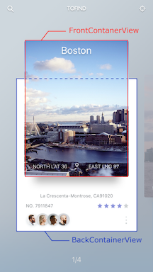

# expanding-collection

[](http://twitter.com/Ramotion)
<!-- [](https://cocoapods.org/pods/Navigation-stack) -->
<!-- [](http://cocoapods.org/pods/Navigation-stack) -->
<!-- [](https://travis-ci.org/Ramotion/navigation-stack) -->
<!-- [](https://codebeat.co/projects/github-com-ramotion-navigation-stack) -->

[shot on dribbble](https://dribbble.com/shots/2741477-iOS-Expanding-Collection-Open-Source):


The [iPhone mockup](https://store.ramotion.com/product/iphone-6-mockups?utm_source=gthb&utm_medium=special&utm_campaign=expanding-collection) available [here](https://store.ramotion.com/product/iphone-6-mockups?utm_source=gthb&utm_medium=special&utm_campaign=expanding-collection).

## Requirements

- iOS 8.0+
- Xcode 7.3

## Installation

Just add the Source folder to your project.

or use [CocoaPods](https://cocoapods.org) with Podfile:
``` ruby
pod 'expanding-collection', '~> 0.0.2'
```
## Usage

`import expanding_collection`

#### Create CollectionViewCell


1) Create UICollectionViewCell inherit from `BasePageCollectionCell` (recommend create cell with xib file)

2) Adding FrontView
  - add view to YOUCELL.xib file and outlet it to `@IBOutlet weak var frontContainerView: UIView!`  property  
  - add width, height, centerX and centerY constranints. (width and height constranints must equal cellSize)

    
  - outlet centerY constranints to `@IBOutlet weak var frontConstraintY: NSLayoutConstraint!`
  - add any uiviews to frontView

3) Adding BackView
  - repeat step 3 (connect outlets to `@IBOutlet weak var backContainerView: UIView!`, `@IBOutlet weak var backConstraintY: NSLayoutConstraint!`)

4) Cell example [DemoCell](https://github.com/Ramotion/expanding-collection/tree/master/DemoExpandingCollection/DemoExpandingCollection/ViewControllers/DemoViewController/Cells)

######   If set tag = 101 for any FrontView.subviews this view hidden on animation

#### Create CollectionViewController  

1) Create UIViewController inherit from `ExpandingViewController`

2) Register Cell and set Cell size:

  ``` swift
  override func viewDidLoad() {
      itemSize = CGSize(width: 214, height: 264)
      super.viewDidLoad()

      // register cell
      let nib = UINib(nibName: "CellIdentifier", bundle: nil)
      collectionView?.registerNib(nib, forCellWithReuseIdentifier: String(DemoCollectionViewCell))
  }
  ```

3) Add UICollectionViewDataSource methods

``` swift
extension YourViewController {

  override func collectionView(collectionView: UICollectionView, numberOfItemsInSection section: Int) -> Int {
    return items.count
  }

  override func collectionView(collectionView: UICollectionView, cellForItemAtIndexPath indexPath: NSIndexPath) -> UICollectionViewCell {
    let cell = collectionView.dequeueReusableCellWithReuseIdentifier("CellIdentifier"), forIndexPath: indexPath)
    // configure cell
    return cell
  }
}
```

4) Open Cell animation

override func viewDidLoad() {
    itemSize = CGSize(width: 214, height: 264)
    super.viewDidLoad()

    // register cell
    let nib = UINib(nibName: "CellIdentifier", bundle: nil)
    collectionView?.registerNib(nib, forCellWithReuseIdentifier: String(DemoCollectionViewCell))
}

``` swift
  func collectionView(collectionView: UICollectionView, didSelectItemAtIndexPath indexPath: NSIndexPath) {

      cell.cellIsOpen(!cell.isOpened)
    }
```

#### Transition animation

1) Create UITableViewController inherit from `ExpandingTableViewController`

2) Set header height default 236

``` swift
override func viewDidLoad() {
    super.viewDidLoad()
    headerHeight = ***
}  
```

3) Call push method in YourViewController to YourTableViewController

``` swift
  if cell.isOpened == true {
    let vc: YourTableViewController = // ... create view controller  
    pushToViewController(vc)
  }
```


## Licence

Navigation-stack is released under the MIT license.
See [LICENSE](./LICENSE) for details.

## About
The project maintained by [app development agency](https://ramotion.com?utm_source=gthb&utm_medium=special&utm_campaign=expanding-collection) [Ramotion Inc.](https://ramotion.com?utm_source=gthb&utm_medium=special&utm_campaign=expanding-collection)
See our other [open-source projects](https://github.com/ramotion) or [hire](https://ramotion.com?utm_source=gthb&utm_medium=special&utm_campaign=expanding-collection) us to design, develop, and grow your product.

[](https://twitter.com/intent/tweet?text=https://github.com/ramotion/expanding-collection)
[](https://twitter.com/ramotion)
